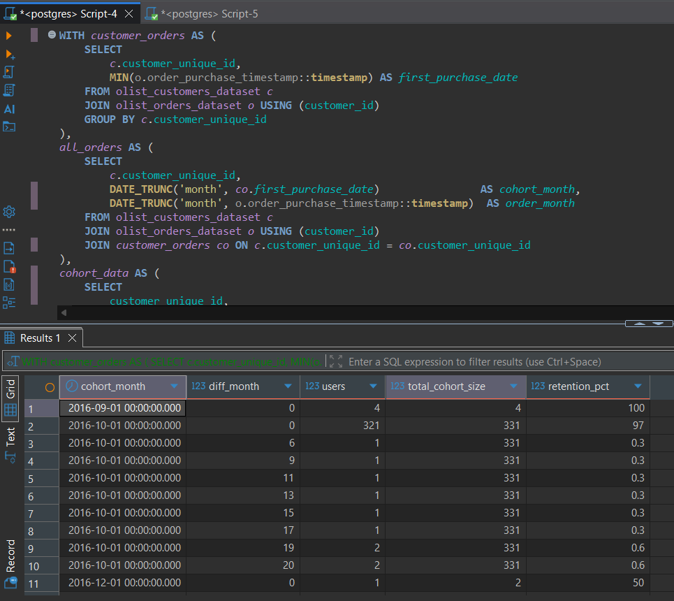
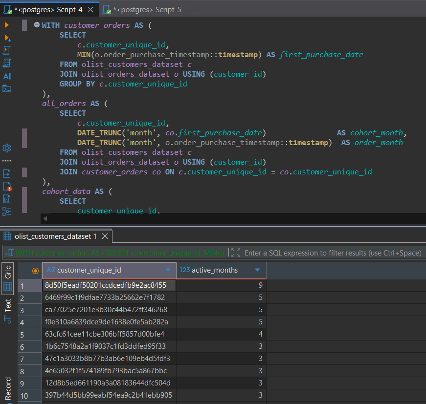
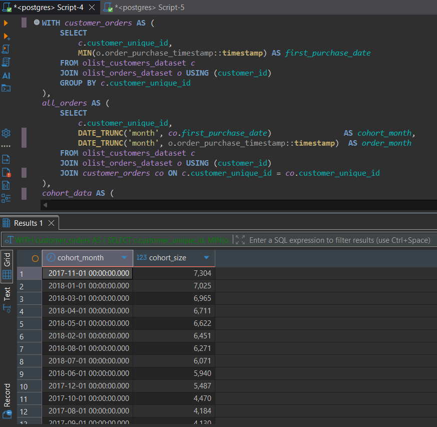
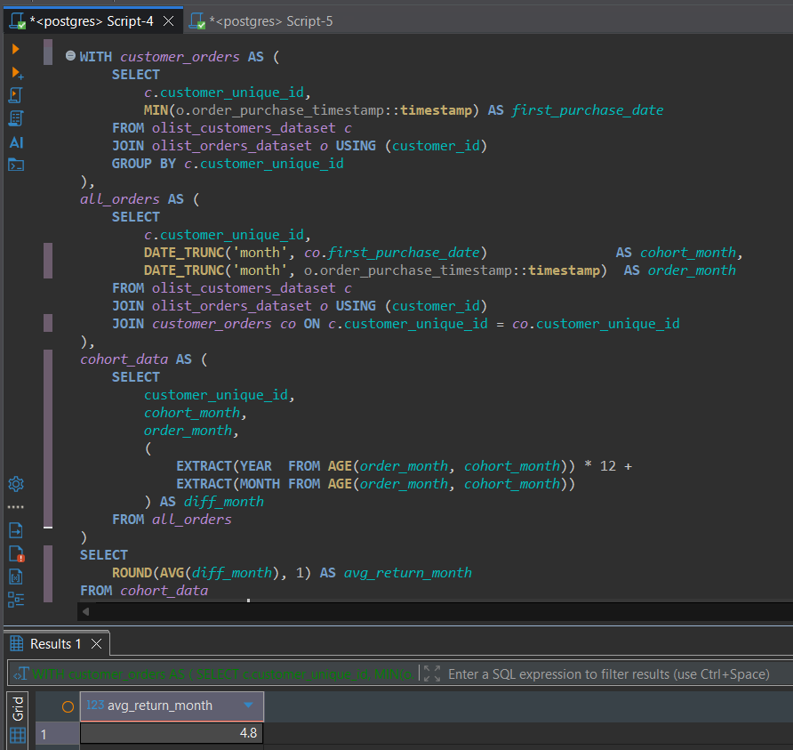

# Customer Retention & Cohort Analysis (SQL)

**Author:** Baimyrza Tarlan
**Location:** Astana, Kazakhstan
**Email:** tarlan.b06@gmail.com

---

## Objective

Analyze customer retention patterns in an e-commerce platform by tracking
cohorts of customers from their first purchase and measuring how many return
over time — and when.

Core question: "Do customers come back, and how often?"

---

## Dataset

Source: https://www.kaggle.com/datasets/olistbr/brazilian-ecommerce

Real e-commerce data from a Brazilian marketplace with 96,000+ orders,
99,000+ customers across a 2-year period (2016–2018).

Tables used:
- olist_orders_dataset
- olist_customers_dataset
- olist_order_items_dataset

---

## Tools & Technologies

- PostgreSQL
- DBeaver
- SQL

---

## What is Cohort Analysis?

A cohort is a group of customers who made their first purchase in the same month.
We track each cohort over time to see how many customers return in subsequent months.

Example:
- Cohort November 2017 = all customers who bought for the first time in November 2017
- We then track: how many of them bought again in December 2017? In January 2018?

This reveals the true retention health of the business.

---

## Skills Applied

- CTE (Common Table Expressions) — 4 chained CTEs in one query
- DATE_TRUNC — truncating timestamps to month level
- AGE + EXTRACT — calculating difference in months between dates
- COUNT DISTINCT — avoiding duplicate customer counts
- SUM OVER PARTITION BY — window function for cohort totals
- ROUND — formatting retention percentages
- HAVING — filtering out small, statistically insignificant cohorts
- GROUP BY / ORDER BY — aggregation and sorting

---

## Key Business Questions

- What percentage of customers return after their first purchase?
- Which cohorts have the best retention?
- Who are the most loyal customers?
- On average, how long does it take for a customer to return?
- Which monthly cohorts are large enough to be statistically meaningful?

---

## Key Insights

- Overall retention is extremely low — less than 5% of customers return
  after their first purchase, which is a critical business problem.

- The most loyal customer returned across 9 different months,
  while most returning customers were active for only 3 months.

- November 2017 was the largest cohort with 7,304 new customers,
  followed by January 2018 (7,025) and March 2018 (6,965).
  This suggests strong seasonal growth in late 2017 and early 2018.

- On average, returning customers come back 4.8 months after
  their first purchase — meaning retention efforts need to focus
  on the first 1-3 months after acquisition.

- All cohorts above 100 customers are from October 2016 onwards,
  confirming the business scaled significantly from that point.

---

## Sample Results

### Retention Table (Main Query)



### Top Returning Customers



### Large Cohorts (HAVING > 100)



### Average Return Month



---

## Final Conclusion

The cohort analysis reveals a significant retention problem for Olist.
While the platform successfully acquires large numbers of new customers
(up to 7,304 in a single month), it fails to bring them back —
with retention rates below 5% across all cohorts.

The average return gap of 4.8 months suggests that customers who do return
are not driven by habit but by occasional need. To improve retention,
the business should focus on re-engagement campaigns within the first
1-3 months after a customer's first purchase, when the probability
of return is highest.

---

## Project Structure

```
customer-retention-cohort-sql/
│
├── sql/
│   └── analysis.sql
├── screenshots/
│   ├── retention_table.png
│   ├── top_returning_customers.png
│   ├── large_cohorts.png
│   └── avg_return_month.png
└── README.md
```

---

## What I Learned

- How to build cohort analysis from scratch using only SQL
- How to chain multiple CTEs to break down a complex problem step by step
- How to work with timestamps and calculate time differences in months
- How to use window functions to calculate group-level metrics per row
- How low retention rates reveal real business problems in the data
- Why HAVING is important when working with cohorts of different sizes

---

## Contact

Email: tarlan.b06@gmail.com